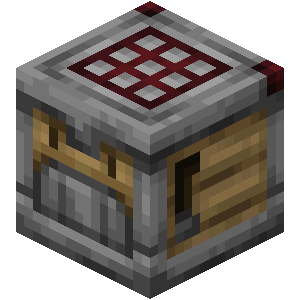

# Crafter Backport

This mod adds the Crafter block from the 1.21 update to **1.20.x**.

### What it does

The Crafter automatically crafts whichever crafting recipe is in its inventory. The inventory can be filled by hand or blocks that output their items such as hoppers or dispensers. To craft said recipe, you must supply a redstone signal to the Crafter and the result along with the byproducts (like buckets in the cake recipe) will be passed through the front.

My implementation includes the tick cooldown change.

### Dependencies

Crafter Backport requires the Fabric Loader and Fabric API.

### What versions does this mod support

The mod currently supports the following versions:

* 1.20.2
* 1.20.1
* 1.20

I also plan on adding support to the following versions:

* 1.20.6 (For adding the crafter only without the other things from the experimental toggle.)
* 1.20.5 (For adding the crafter only without the other things from the experimental toggle.)
* 1.20.4 (For adding the crafter only without the other things from the experimental toggle.)
* 1.20.3 (For adding the crafter only without the other things from the experimental toggle.)
* 1.18.x (All 1.18 versions)
* 1.16.x (All 1.16 versions)
* 1.12.2 (Using Ornithe, maybe a Forge version too.)
